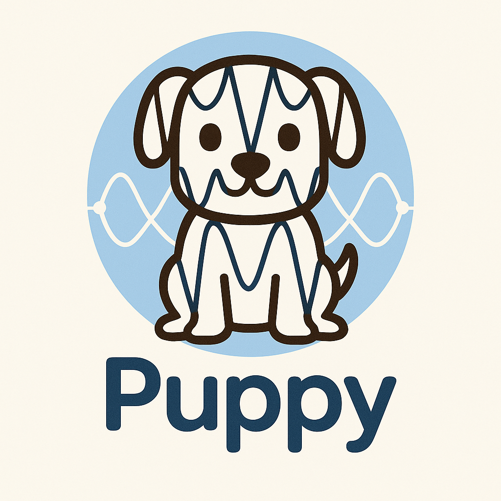

<div id="toc">

 

  <ul style="list-style: none">
    <summary>
      <h2> <pre>puppy - Phonon Unfolding and Projections</pre></h2>
    </summary>
  </ul>
</div>

```! Currently in Development - use with caution ! ```

`puppy` is a code for unfolding defect phonons and projecting atomic eigendisplacements onto phonon dispersion curves.

### Installation

```
git clone https://github.com/badw/puppy.git 
cd puppy 
pip install . 
```

### Examples

an example Jupyter Notebook can be found here: 


`./examples/example.ipynb`

> result for $V_{Ag}$ in AgI:

<p align="center">

</p>