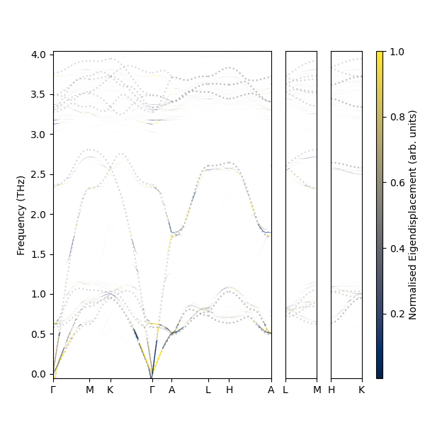

# Phonon Unfolding and Projections (Puppy)

<p align="center">

</p>

> $V_{Ag}$ in AgI

## Installation

```
pip install puppy
```

## Pre-Workflow

<p align="center">

</p>

## Usage

see `notebooks/example.ipynb` for an example usage

## Todo:

- [ ] multiprocess some features
- [ ] add a spectral function
- [ ] change from a scatter plot 
- [ ] make it work for non vacancies
